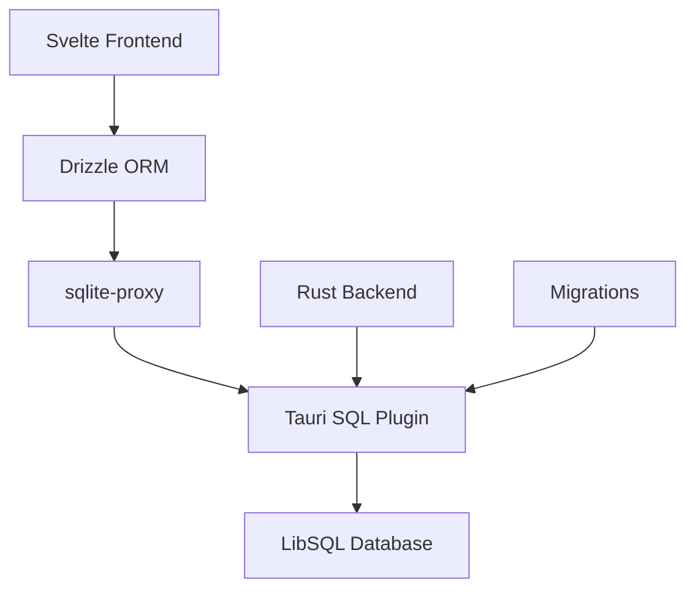

Container Kit uses **LibSQL** (SQLite-compatible) with **Drizzle ORM** for type-safe database operations, managed through Tauri's SQL plugin.

## Database Stack

<CardGroup cols={3}>
  <Card title="LibSQL" icon="database">
    SQLite-compatible embedded database
  </Card>
  <Card title="Drizzle ORM" icon="code">
    Type-safe TypeScript ORM
  </Card>
  <Card title="Tauri SQL Plugin" icon="plug">
    Bridge between Rust and frontend
  </Card>
</CardGroup>

## Architecture Overview

The database layer spans both frontend (TypeScript) and backend (Rust):



## Schema Definition

Schemas are defined using Drizzle ORM in TypeScript:

```typescript src/lib/db/schema.ts
import { sqliteTable, integer, text } from 'drizzle-orm/sqlite-core';
import { v7 as uuid } from 'uuid';

export const registry = sqliteTable('registry', {
    id: text('id')
        .primaryKey()
        .$defaultFn(() => uuid()),
    name: text('name').notNull(),
    url: text('url').unique().notNull(),
    loggedIn: integer('logged_in', { mode: 'boolean' }).default(false)
});

export const seeds = sqliteTable('seeds', {
    id: text('id')
        .primaryKey()
        .$defaultFn(() => uuid()),
    name: text('name').notNull().unique(),
    applied: integer('applied', { mode: 'boolean' }).default(false)
});
```

### Schema Features

<AccordionGroup>
  <Accordion title="UUID Primary Keys">
    Tables use UUIDv7 for primary keys, providing time-ordered unique identifiers:
    
    ```typescript
    id: text('id')
        .primaryKey()
        .$defaultFn(() => uuid())
    ```
  </Accordion>

  <Accordion title="Type-Safe Booleans">
    Boolean fields use SQLite integers with type hints:
    
    ```typescript
    loggedIn: integer('logged_in', { mode: 'boolean' }).default(false)
    ```
  </Accordion>

  <Accordion title="Unique Constraints">
    Unique constraints ensure data integrity:
    
    ```typescript
    url: text('url').unique().notNull()
    ```
  </Accordion>
</AccordionGroup>

## Database Client

The database client uses Drizzle's `sqlite-proxy` to communicate with Tauri's SQL plugin:

```typescript src/lib/db/index.ts
import { drizzle } from 'drizzle-orm/sqlite-proxy';
import * as schema from './schema';
import Database from '@tauri-apps/plugin-sql';

const selectRegex = /^\s*SELECT\b/i;

function isSelectQuery(sql: string): boolean {
    return selectRegex.test(sql);
}

export const db = drizzle<typeof schema>(
    async (sql: string, params: string[], method: string) => {
        const sqlite = await Database.load('sqlite:container-kit.db');
        let rows: any[] = [];
        let results: any = [];

        try {
            if (isSelectQuery(sql)) {
                rows = await sqlite.select(sql, params as string[]);
            } else {
                await sqlite.execute(sql, params as string[]);
                return { rows: [] };
            }

            // Convert object rows to array format for Drizzle
            rows = rows.map((row: any) => Object.values(row));
            results = method === 'all' ? rows : rows[0];
        } catch (e: any) {
            console.error('SQL Error:', e);
            return { rows: [] };
        } finally {
            await sqlite.close(); // Always close connection
        }

        return { rows: results };
    },
    { schema: schema, logger: true }
);
```

### Key Design Decisions

<Steps>
  <Step title="SELECT Query Detection">
    Uses regex to distinguish SELECT from INSERT/UPDATE/DELETE queries, as each requires different handling.
  </Step>
  
  <Step title="Row Format Conversion">
    Tauri SQL plugin returns objects, but Drizzle expects arrays. The client converts between formats:
    
    ```typescript
    rows = rows.map((row: any) => Object.values(row));
    ```
  </Step>
  
  <Step title="Connection Management">
    Database connections are opened per-query and always closed in the `finally` block to prevent leaks.
  </Step>
  
  <Step title="Error Handling">
    SQL errors are logged and return empty results to prevent crashes.
  </Step>
</Steps>

## Database Migrations

### Migration Workflow

Container Kit uses a two-stage migration process:

<Tabs>
  <Tab title="TypeScript Schema">
    1. Define schema in `src/lib/db/schema.ts`
    2. Generate SQL migrations with Drizzle Kit:
    
    ```bash
    pnpm db:generate
    ```
    
    This creates SQL files in `src-tauri/migrations/`
  </Tab>
  
  <Tab title="Rust Migration Loading">
    Generated migrations are converted to Rust code:
    
    ```bash
    pnpm db:migrations:rust
    ```
    
    This runs `scripts/generate-migrations.ts` to create `src-tauri/migrations/generated_migrations.rs`
  </Tab>
  
  <Tab title="Tauri Plugin">
    Migrations are loaded and applied on app startup:
    
    ```rust
    let migrations = load_migrations();
    
    builder.plugin(
        tauri_plugin_sql::Builder::default()
            .add_migrations("sqlite:container-kit.db", migrations)
            .build(),
    )
    ```
  </Tab>
</Tabs>

### Migration Configuration

```typescript drizzle.config.ts
import { defineConfig } from 'drizzle-kit';

export default defineConfig({
    out: './src-tauri/migrations/',
    schema: './src/lib/db/schema.ts',
    dialect: 'sqlite',
    verbose: true,
    strict: true
});
```

### Example Migration

```sql src-tauri/migrations/0000_slow_scarecrow.sql
CREATE TABLE `registry` (
	`id` text PRIMARY KEY NOT NULL,
	`name` text NOT NULL,
	`url` text NOT NULL,
	`logged_in` integer DEFAULT false
);

CREATE UNIQUE INDEX `registry_url_unique` ON `registry` (`url`);

CREATE TABLE `seeds` (
	`id` text PRIMARY KEY NOT NULL,
	`name` text NOT NULL,
	`applied` integer DEFAULT false
);

CREATE UNIQUE INDEX `seeds_name_unique` ON `seeds` (`name`);
```

## Database Operations

### Type-Safe Queries

Drizzle provides fully typed database operations:

```typescript
import { db } from '$lib/db';
import { registry } from '$lib/db/schema';
import { eq } from 'drizzle-orm';

// Insert
const newRegistry = await db.insert(registry).values({
    name: 'Docker Hub',
    url: 'https://registry.hub.docker.com',
    loggedIn: false
});

// Select all
const allRegistries = await db.select().from(registry);

// Select with filter
const loggedInRegistries = await db
    .select()
    .from(registry)
    .where(eq(registry.loggedIn, true));

// Update
await db
    .update(registry)
    .set({ loggedIn: true })
    .where(eq(registry.url, 'https://registry.hub.docker.com'));

// Delete
await db
    .delete(registry)
    .where(eq(registry.id, 'some-uuid'));
```

### Service Layer

Database operations are typically wrapped in service functions:

```typescript src/lib/services/sqlite/registry.ts
import { db } from '$lib/db';
import { registry } from '$lib/db/schema';
import { eq } from 'drizzle-orm';

export async function getAllRegistries() {
    return await db.select().from(registry);
}

export async function addRegistry(name: string, url: string) {
    return await db.insert(registry).values({ name, url });
}

export async function loginRegistry(id: string) {
    return await db
        .update(registry)
        .set({ loggedIn: true })
        .where(eq(registry.id, id));
}

export async function removeRegistry(id: string) {
    return await db.delete(registry).where(eq(registry.id, id));
}
```

## Database Location

The database file is stored in the application data directory:

<Tabs>
  <Tab title="macOS">
    ```
    ~/Library/Application Support/com.ethercorps.container-kit/container-kit.db
    ```
  </Tab>
</Tabs>

<Note>
The database is automatically created and migrated on first launch using Tauri's SQL plugin.
</Note>

## Best Practices

<CardGroup cols={2}>
  <Card title="Always Close Connections" icon="circle-xmark">
    Use `try/finally` blocks to ensure database connections are closed:
    
    ```typescript
    try {
        // Database operations
    } finally {
        await sqlite.close();
    }
    ```
  </Card>
  
  <Card title="Use Transactions" icon="arrows-rotate">
    For multiple related operations, use transactions to ensure atomicity:
    
    ```typescript
    await db.transaction(async (tx) => {
        await tx.insert(registry).values(...);
        await tx.insert(seeds).values(...);
    });
    ```
  </Card>
  
  <Card title="Validate Input" icon="shield-check">
    Always validate user input before database operations:
    
    ```typescript
    if (!isValidUrl(url)) {
        throw new Error('Invalid URL');
    }
    ```
  </Card>
  
  <Card title="Handle Errors" icon="triangle-exclamation">
    Catch and handle database errors gracefully:
    
    ```typescript
    try {
        await db.insert(registry).values(...);
    } catch (error) {
        console.error('Failed to insert:', error);
        // Show user-friendly error
    }
    ```
  </Card>
</CardGroup>

## Seeding Data

The `seeds` table tracks which seed scripts have been applied:

```typescript src/lib/db/seeds/registry.ts
import { db } from '$lib/db';
import { registry, seeds } from '$lib/db/schema';
import { eq } from 'drizzle-orm';

const SEED_NAME = 'default-registries';

export async function seedDefaultRegistries() {
    // Check if already applied
    const existing = await db
        .select()
        .from(seeds)
        .where(eq(seeds.name, SEED_NAME));
    
    if (existing.length > 0 && existing[0].applied) {
        return; // Already seeded
    }
    
    // Add default registries
    await db.insert(registry).values([
        { name: 'Docker Hub', url: 'https://registry.hub.docker.com' },
        { name: 'GitHub', url: 'https://ghcr.io' }
    ]);
    
    // Mark as applied
    await db.insert(seeds).values({
        name: SEED_NAME,
        applied: true
    });
}
```

## Performance Considerations

<Warning>
SQLite is single-threaded. For concurrent operations, ensure queries are properly queued or use transactions.
</Warning>

### Indexing

Unique constraints automatically create indexes:

```sql
CREATE UNIQUE INDEX `registry_url_unique` ON `registry` (`url`);
```

For frequently queried columns, add explicit indexes:

```typescript
export const registry = sqliteTable('registry', {
    // ... fields
}, (table) => ({
    nameIdx: index('name_idx').on(table.name),
}));
```

## Next Steps

<CardGroup cols={2}>
  <Card title="Architecture" icon="sitemap" href="/advanced/architecture">
    Learn about the overall application architecture
  </Card>
  <Card title="Security" icon="shield" href="/advanced/security">
    Understand security features and data protection
  </Card>
</CardGroup>