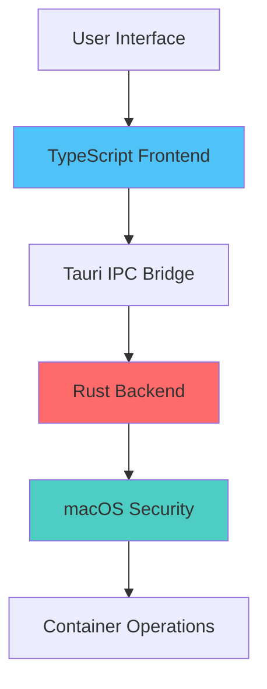

Container Kit leverages Tauri's security model, Rust's memory safety, and macOS sandboxing to provide a secure desktop application for container management.

## Security Architecture

### Multi-Layer Security

Container Kit implements security at multiple layers:



<Steps>
  <Step title="Frontend Security">
    TypeScript with strict typing prevents many runtime errors and type confusion attacks.
  </Step>
  
  <Step title="IPC Boundary">
    Tauri's command system validates all messages between frontend and backend.
  </Step>
  
  <Step title="Rust Memory Safety">
    Rust's ownership model prevents buffer overflows, use-after-free, and data races.
  </Step>
  
  <Step title="macOS Sandboxing">
    Application runs with limited permissions, requesting access only when needed.
  </Step>
</Steps>

## Tauri Security Model

### Content Security Policy

Tauri enforces a Content Security Policy to prevent XSS attacks:

```json tauri.conf.json
{
  "app": {
    "security": {
      "csp": null
    }
  }
}
```

<Note>
In production, configure a strict CSP to prevent inline scripts and unauthorized resource loading.
</Note>

### Command Allowlist

Only explicitly registered Tauri commands are accessible from the frontend:

```rust src-tauri/src/lib.rs
let spectabuilder = Builder::<tauri::Wry>::new().commands(collect_commands![
    greet,
    run_container_command_with_stdin,
    execute_with_elevated_command,
    get_default_shell,
    stream_container_command
]);

builder
    .invoke_handler(spectabuilder.invoke_handler())
    .run(tauri::generate_context!())
```

<Warning>
Never expose commands that execute arbitrary shell commands without validation.
</Warning>

### Type-Safe IPC

All commands use Specta for compile-time type safety:

```rust
#[tauri::command]
#[specta::specta]
pub async fn execute_with_elevated_command(
    command: String,
    args: Vec<String>,
) -> Result<CommandResult, String> {
    // Implementation
}
```

TypeScript bindings are automatically generated:

```typescript src/lib/models/bindings.ts
export async function execute_with_elevated_command(
    command: string,
    args: string[]
): Promise<CommandResult>
```

## Privilege Escalation

Container operations often require elevated privileges. Container Kit handles this securely:

### Elevated Command Execution

```rust src-tauri/src/commands/system.rs
use elevated_command::Command;

#[tauri::command]
#[specta::specta]
pub async fn execute_with_elevated_command(
    command: String,
    args: Vec<String>,
) -> Result<CommandResult, String> {
    let is_elevated = Command::is_elevated();

    let mut cmd = StdCommand::new(&command);
    cmd.args(&args);

    let output = if is_elevated {
        // Already elevated - execute directly
        cmd.output().map_err(|e| e.to_string())?
    } else {
        // Request elevation with macOS system prompt
        let mut elevated_cmd = Command::new(cmd);
        elevated_cmd.name("ContainerKit".to_string());
        elevated_cmd.icon(include_bytes!("../../icons/icon.icns").to_vec());
        elevated_cmd.output().map_err(|e| e.to_string())?
    };

    Ok(CommandResult {
        signal: output.status.signal(),
        stdout: String::from_utf8_lossy(&output.stdout).to_string(),
        stderr: String::from_utf8_lossy(&output.stderr).to_string(),
        code: output.status.code(),
    })
}
```

### Key Security Features

<AccordionGroup>
  <Accordion title="Privilege Detection">
    Checks if the app is already running with elevated privileges before requesting elevation:
    
    ```rust
    let is_elevated = Command::is_elevated();
    ```
  </Accordion>

  <Accordion title="macOS System Prompts">
    Uses macOS's native elevation dialog, showing the app name and icon:
    
    ```rust
    elevated_cmd.name("ContainerKit".to_string());
    elevated_cmd.icon(include_bytes!("../../icons/icon.icns").to_vec());
    ```
    
    This prevents spoofing and provides clear user consent.
  </Accordion>

  <Accordion title="Command Validation">
    Always validate commands before execution:
    
    ```rust
    // Whitelist allowed commands
    const ALLOWED_COMMANDS: &[&str] = &["container", "docker", "podman"];
    
    if !ALLOWED_COMMANDS.contains(&command.as_str()) {
        return Err("Unauthorized command".to_string());
    }
    ```
  </Accordion>
</AccordionGroup>

## Container CLI Security

### Sidecar Binary

Container Kit bundles the Apple Container CLI as a sidecar binary:

```json tauri.conf.json
{
  "bundle": {
    "externalBin": [
      "binaries/sidecar/apple-container/bin/container"
    ],
    "resources": [
      "binaries/sidecar/apple-container/**/*"
    ]
  }
}
```

### Benefits

<CardGroup cols={2}>
  <Card title="Version Control" icon="tag">
    Bundles a specific, tested version of the container CLI, preventing version conflicts.
  </Card>
  
  <Card title="Path Isolation" icon="folder-tree">
    Uses bundled binary instead of system PATH, preventing PATH injection attacks.
  </Card>
  
  <Card title="Integrity" icon="shield-check">
    Binary is included in the signed app bundle, verified by macOS Gatekeeper.
  </Card>
  
  <Card title="No System Dependency" icon="circle-xmark">
    Works without requiring system-wide CLI installation.
  </Card>
</CardGroup>

### Command Execution

```typescript src/lib/services/containerization/utils.ts
import { Command } from '@tauri-apps/plugin-shell';

export function createContainerCommand(args: string[]): Command<string> {
    // Uses bundled sidecar binary
    return Command.create('container', args);
}
```

<Note>
The sidecar binary path is automatically resolved by Tauri, ensuring consistent execution across environments.
</Note>

## Database Security

### Data Protection

The SQLite database is stored in the application data directory:

```
~/Library/Application Support/com.ethercorps.container-kit/container-kit.db
```

<Tabs>
  <Tab title="File Permissions">
    The database file inherits macOS user-level permissions, readable only by the current user.
  </Tab>
  
  <Tab title="SQL Injection Prevention">
    Drizzle ORM uses parameterized queries, preventing SQL injection:
    
    ```typescript
    // Safe - parameterized
    await db.select().from(registry).where(eq(registry.id, userId));
    
    // Unsafe - string concatenation (don't do this)
    await sqlite.execute(`SELECT * FROM registry WHERE id = '${userId}'`);
    ```
  </Tab>
  
  <Tab title="Connection Security">
    Database connections are short-lived and always closed:
    
    ```typescript
    try {
        rows = await sqlite.select(sql, params);
    } finally {
        await sqlite.close();
    }
    ```
  </Tab>
</Tabs>

### Sensitive Data

<Warning>
Never store passwords or secrets in plain text. Use macOS Keychain for sensitive credentials:

```typescript
import { Store } from '@tauri-apps/plugin-store';

const store = new Store('settings.json');

// Store non-sensitive settings
await store.set('theme', 'dark');

// For passwords, use macOS Keychain instead
```
</Warning>

## Input Validation

### Command Arguments

Validate all user input before passing to shell commands:

```typescript
export function validateContainerId(id: string): boolean {
    // Only allow alphanumeric and common safe characters
    return /^[a-zA-Z0-9_-]+$/.test(id);
}

export async function startContainer(id: string): Promise<Output> {
    if (!validateContainerId(id)) {
        throw new Error('Invalid container ID');
    }
    
    const command = createContainerCommand(['start', id]);
    return await command.execute();
}
```

### User Input Sanitization

```typescript
export function sanitizeImageName(name: string): string {
    // Remove potentially dangerous characters
    return name.replace(/[^a-zA-Z0-9:._/-]/g, '');
}

export function sanitizeUrl(url: string): string {
    try {
        const parsed = new URL(url);
        // Only allow https and http
        if (!['https:', 'http:'].includes(parsed.protocol)) {
            throw new Error('Invalid protocol');
        }
        return parsed.toString();
    } catch {
        throw new Error('Invalid URL');
    }
}
```

## Hardened Runtime

macOS hardened runtime provides additional security:

```json tauri.conf.json
{
  "bundle": {
    "macOS": {
      "hardenedRuntime": true,
      "minimumSystemVersion": "26.0"
    }
  }
}
```

### Runtime Protections

<Steps>
  <Step title="Code Signing">
    App is signed with a Developer ID certificate, verified by macOS Gatekeeper.
  </Step>
  
  <Step title="Library Validation">
    Only Apple-signed or same-team-signed libraries can be loaded.
  </Step>
  
  <Step title="Memory Protections">
    Prevents code injection and runtime modification.
  </Step>
  
  <Step title="Notarization">
    App is notarized by Apple, scanned for malware before distribution.
  </Step>
</Steps>

## Update Security

Container Kit supports secure auto-updates:

```json tauri.conf.json
{
  "plugins": {
    "updater": {
      "pubkey": "dW50cnVzdGVkIGNvbW1lbnQ6..."
    }
  }
}
```

### Signed Updates

<Tabs>
  <Tab title="Signature Verification">
    Updates are signed with a private key and verified with the embedded public key:
    
    ```rust
    .plugin(tauri_plugin_updater::Builder::new().build())
    ```
  </Tab>
  
  <Tab title="HTTPS Only">
    Update manifests and downloads use HTTPS exclusively.
  </Tab>
  
  <Tab title="Integrity Checks">
    Downloaded updates are hashed and verified before installation.
  </Tab>
</Tabs>

## Security Checklist

<Accordion title="Development">
  - [ ] Use strict TypeScript configuration
  - [ ] Enable Rust clippy and fix all warnings
  - [ ] Validate all user input
  - [ ] Use parameterized queries
  - [ ] Never log sensitive data
  - [ ] Review command allowlist
</Accordion>

<Accordion title="Build">
  - [ ] Build in release mode for production
  - [ ] Enable hardened runtime
  - [ ] Sign with valid Developer ID certificate
  - [ ] Notarize the app with Apple
  - [ ] Generate update signature keys
  - [ ] Test on clean macOS installation
</Accordion>

<Accordion title="Distribution">
  - [ ] Serve updates over HTTPS
  - [ ] Sign update manifests
  - [ ] Document minimum macOS version (26.0+)
  - [ ] Provide SHA-256 checksums
  - [ ] Maintain changelog of security fixes
</Accordion>

## Best Practices

<CardGroup cols={2}>
  <Card title="Principle of Least Privilege" icon="key">
    Request elevated permissions only when necessary, not on app launch.
  </Card>
  
  <Card title="Defense in Depth" icon="shield-halved">
    Layer multiple security controls - validation, type safety, sandboxing.
  </Card>
  
  <Card title="Fail Securely" icon="circle-xmark">
    On errors, deny access rather than falling back to permissive behavior.
  </Card>
  
  <Card title="Security Updates" icon="rotate">
    Keep dependencies updated and monitor security advisories.
  </Card>
</CardGroup>

## Reporting Security Issues

<Warning>
**DO NOT** create public GitHub issues for security vulnerabilities.

Email security issues to: [shivam@ethercorps.io](mailto:shivam@ethercorps.io)

Include:
- Description of the vulnerability
- Steps to reproduce
- Potential impact
- Suggested fixes (if any)
</Warning>

## Next Steps

<CardGroup cols={2}>
  <Card title="Performance" icon="gauge-high" href="/advanced/performance">
    Learn about performance optimizations and benchmarking
  </Card>
  <Card title="Architecture" icon="sitemap" href="/advanced/architecture">
    Understand the overall application architecture
  </Card>
</CardGroup>